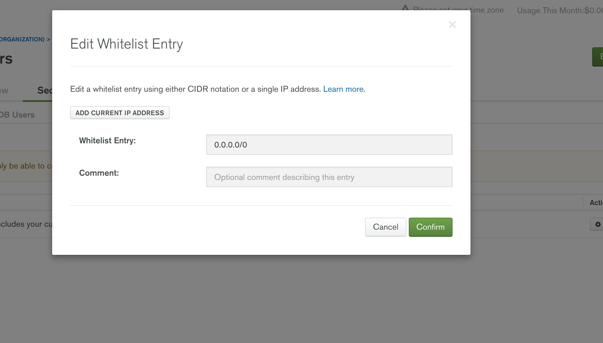
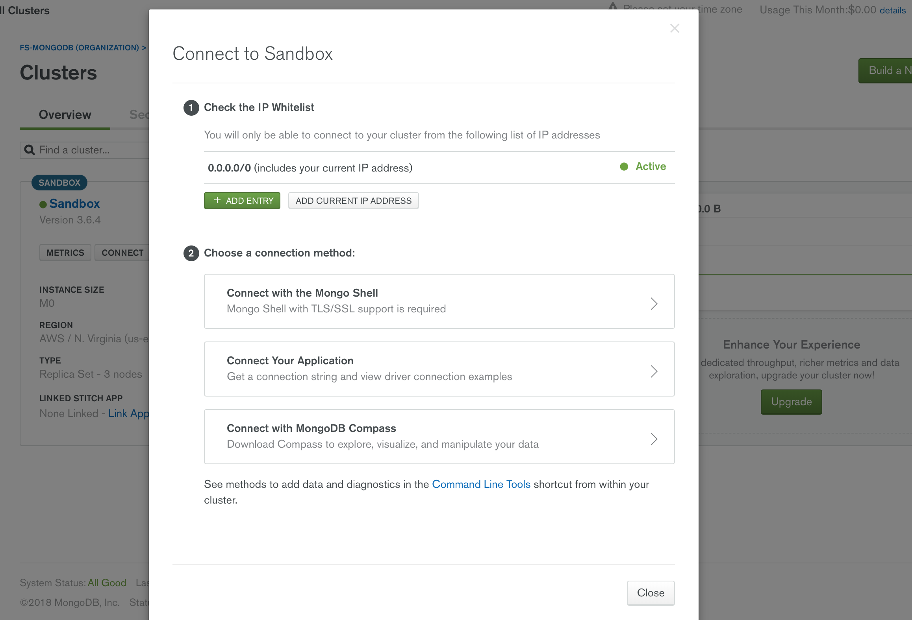
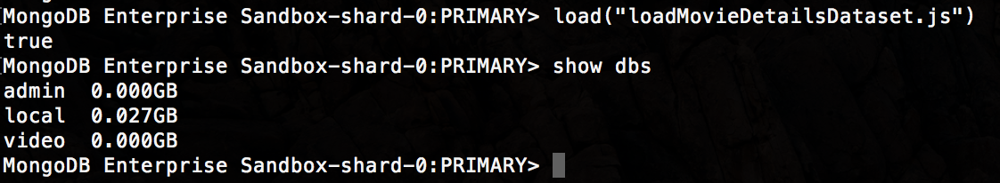

# mongodb tutorial [https://docs.mongodb.com/manual/introduction/](https://docs.mongodb.com/manual/introduction/)

> Connect to Atlas dbs:
mongo "mongodb://cluster0-shard-00-00-jxeqq.mongodb.net:27017,cluster0-shard-00-00-jxeqq.mongodb.net:27017,cluster0-shard-00-00-jxeqq.mongodb.net:27017/data?replicaSet=Cluster0-shard-0" --ssl --authenticationDatabase admin --username m001-student --password m001-mongodb-basics

## get MongoDB Compass (or robomongo)

MongoDB Compass is a GUI that allows you to interact with your databases. Once you open the GUI, use your database credentials to connect to your DBs.

[Download here](https://www.mongodb.com/download-center?_ga=2.1085937.15138774.1525100686-1997388355.1524597165#compass)

## Robomongo [https://robomongo.org/](https://robomongo.org/)

Robomongo is a GUI that allows us to interact with our mongdb database directly. 

After you start your mongodb (`mongod`) you can open the GUI and you should be able to see the dbs hosted on your system.


## Mongo Atlas [https://www.mongodb.com/cloud](https://www.mongodb.com/cloud)
Cloud based mongo service. 

1. Create your account

2. Create a free or paid cluster (cluster of servers) 

3. After cluster is created:

  • select the "security" tab and add an admin SCRAM user

  • whitelist the IPs that can connect to your cluster (you have an option to whitelist all IPs)


__Whitelist__


4. Under "overview" tab, click on "connect" to ge the code that connects with your cluster via mongo shell, via your app (ruby, node, java, python), or via mongo Compass.

__Connect panel__


__Connect app__


__Connect shell__


## Create DB and insert data (check mongo methods on "loadMovieDetailsDataset.js")

1. cd into the directory where you have the data you want to insert on the DB

2. Make sure your .js file has the data and the right methods to insert that data where you need it.

3. Connect to your cluster or standalone DB -- you can connect to a local db if you want, just make sure you create it first via robomongo or via mongo shell (`use <dbName>` creates db and let's you interact with it).

e.g. (cluster connection)

```bash
#this command works for mongo shell 3.6 or later--this command prompts you to enter the password
mongo "mongodb+srv://sandbox-hj5gk.mongodb.net/test" --username m001-student

#for older versions, this is the command
mongo "mongodb://sandbox-shard-00-00-hj5gk.mongodb.net:27017,sandbox-shard-00-01-hj5gk.mongodb.net:27017,sandbox-shard-00-02-hj5gk.mongodb.net:27017/test?replicaSet=Sandbox-shard-0" --ssl --authenticationDatabase admin --username m001-student --password <PASSWORD>
```

4. run `load(<dbFileName.js>)`

This will create the new db as specified on the .js file you load (in this example, "video"). e.g.

__Load data__



> After db is created, you can insert collections/documents using scripts as well. For instance, the command below runs the script "loadReviewsDataset.js" against the recently created "video" DB

```bash
#bash -v 3.6 or later
#notice you need to add the db name (video) on the db URL
mongo "mongodb+srv://sandbox-hj5gk.mongodb.net/video" --username m001-student loadReviewsDataset.js

# bash less than 3.6
mongo "mongodb://sandbox-shard-00-00-hj5gk.mongodb.net:27017,sandbox-shard-00-01-hj5gk.mongodb.net:27017,sandbox-shard-00-02-hj5gk.mongodb.net:27017/video?replicaSet=Sandbox-shard-0" --ssl --authenticationDatabase admin --username m001-student --password <PASSWORD> loadReviewsDataset.js
```


## Common Shell Commands [https://docs.mongodb.com/manual/reference/mongo-shell/](https://docs.mongodb.com/manual/reference/mongo-shell/)

```bash
show dbs // shows all dbs
use <dbName> // use db
show collections // shows all collections in the db
db.collectionName.find() // shows collection content
```

## Common Methods [https://docs.mongodb.com/manual/reference/mongo-shell/](https://docs.mongodb.com/manual/reference/mongo-shell/)


### CREATE

__collection.insertOne()__
```bash
  use <dbName> // use this db

  #insert one document 
  # db refers to the db we selected in the step above
  db.collectionName.insertOne({someKey: "some val", someKey: "some val"})
```

__collection.insertMany()__
```bash
  use <dbName>

  #insert many documents 
  #this method inserts documents in order by default (if there is an error, documents stop being #inserted at that point--previously inserted documents are unaffected)
  #To ignore order and prevent errors from executing further into the query we can 
  #pass a second argument {ordered: false} after the documents to be inserted
  db.collectionName.insertMany([
    {someKey: "some val", someKey: "some val"},
    {someKey: "some val", someKey: "some val"}
  ])

  db.collectionName.insertMany([
    {someKey: "some val", someKey: "some val"},
    {someKey: "some val", someKey: "some val"}
  ], {
    ordered: false
  });


```
### READ 

__db.collection.find()__
```bash
#find all
db.collectionName.find()
```

> When querying the DB we can use the `pretty()` method to display a formated json document
e.g. `db.collectionName.find().pretty()`


__db.collection.find({someKey: "someValue"})__ with filter
```bash
#find specific by key
db.collectionName.find({someKey: "someValue"}) (e.g. find({age: 14}))
```

__db.collection.find({"parentKey.childKey.grandchildKey": "someValue"})__ with nested object filter
```bash
#find specific in nested obj
e.g

documents:

{
  id: ObjectId("11823081237"),
  name: "JD"
  profession: {
    title: "web engineer",
    experience: 12,
    currentCompany: {
      name: "Full Sail",
      field: "education"
    },
  },
  {
  id: ObjectId("11823081237"),
  name: "MD",
  profession: {
    title: "db engineer",
    experience: 3,
    currentCompany: {
      name: "UCF",
      field: "education"
    }
  }
}

#this query will return the two documents above
#need to put the key in quotes when it uses dot notation (in mongo shell)
db.collectionName.find({"profession.currentCompany.field": "education"}) 
```

__db.collection.find()__ arrays
```bash
#find in arrays
e.g.

#Person collection

 {
  id: ObjectId("11823081237"),
  name: "JD",
  salary: null,
  profession: {
    title: "web engineer",
    experience: 12,
    currentCompany: {
      name: "Full Sail",
      field: "education"
    },
    pastCompanies: [
      "Amazon",
      "Google",
      "IBM"
    ]
  },
  {
  id: ObjectId("11823081237"),
  name: "MD",
  salary: null,
  profession: {
    title: "db engineer",
    experience: 3,
    currentCompany: {
      name: "UCF",
      field: "education"
    },
    pastCompanies: [
      "Google",
      "Amazon",
      "Reddit"
    ]
  }
}


#We can search all users who have worked on a certain company:
db.collectionName.find({"profession.pastCompanies": "Google"})

#Who have worked on a multiple companies
db.collectionName.find({"profession.pastCompanies": ["Google", "Amazon"]}) #returns arrays where "Google" comes before "Amazon" so the first document above is not a match

#Who have worked on a certain company as long as it is in a specific position in the array (useful when array is ordered by some kind of hierarchy)
db.collectionName.find({"profession.pastCompanies.0": "Google"}) #returns documents where "Google" is index 0 of "pastCompanies" array
```

__utility methods__

__db.collection.find().count()__
```bash
db.collection.find({someKey: "someValue"}).count()
```

__db.collection.find().pretty()__
```bash
#returns the matched documents formatted
db.collection.find({someKey: "someValue"}).pretty()
```

__db.collection.find().explain()__ [https://docs.mongodb.com/manual/reference/method/cursor.explain/](https://docs.mongodb.com/manual/reference/method/cursor.explain/)
```bash
#explains how the query is made--like a debugger
db.collection.find({someKey: "someValue"}).explain()

#gives details about the query execution
db.collection.find({someKey: "someValue"}).explain("executionStats")
```

__Projections__

Projections allow us to limit the fields we want our query to return.

Projections are specified as a second argument to the query. If the projection has a key with the value "1", that field is included in the query; if the value is 0, that field is excluded from the query


e.g.
```bash
#consider the Person collection above
#this query returns only the name field (and _id by default) of people whose experience value is 3

db.collection.find({experience: 3}, {name: 1})

#this query excludes the id from the results
db.collection.find({experience: 3}, {name: 1, _id: 0})


#this query returns all fields but name
db.collection.find({experience: 3}, {name: 0})
```


__simple index on collection for fast document lookups__

Without an index, a query will look up all documents in a collection until it finds the one(s) tha match. If we create an index on a collection the lookups will be much faster as mongo will examine only documents that match the query.

```bash
# "someField" is the property we are indexing so queries performed on that
# field will be faster
db.collection.createIndex({<someField>: 1})

#e.g.
db.collection.createIndex({profession: 1})
db.collection.find({profession: "Software Engineer"})

#NOTE: the property being indexed is not between quotes
```

__multi key (compound) index on collection for fast document lookups__

[compound indexes](https://docs.mongodb.com/manual/core/index-compound/#create-a-compound-index)

```bash
# "someField" is the property we are indexing so queries performed on that
# field will be faster
db.collection.createIndex({<someField>: 1, <someOtherField>: 1})

#e.g.
db.collection.createIndex({item: 1, stock: 1 })
db.collection.find({item: "Software Engineer", stock: "John"})

#NOTE: compound indexes are not just a fast way to create multiple indexes at once
#In the example above, both keys "item" and "stock" are indexed. So whether you use
#them combined or individually the lookup will be fast. However, "The order of the fields listed in a compound index is important. The index will contain references to documents sorted first by the values of the item field and, within each value of the item field, sorted by values of the stock field. See Sort Order for more information."
```


As an exercise, perform a query on a collection before indexing it and after indexing it. In both cases, use the `.explain("executionStats")` on the query and check the property `totalDocsExamined`. The indexed collection should return the count of documents that match the query while the count for the unindexed collection will be the total number documents in that collection.


### UPDATE

__collection.update()__

[update operators](https://docs.mongodb.com/manual/reference/operator/update/)

```bash
#this update operation replaces the whole document of the matched query
collection.updateOne({
  name: "JD"
},
{
  name: "John Doe",
  age: 23
})
```

__collection.update()__ [$addToSet](https://docs.mongodb.com/manual/reference/operator/update/addToSet/)

This operator adds items to a set (array) that already exists

```bash
#this update operation replaces the whole document of the matched query
collection.updateOne({
  name: "JD"
},
{
  $addToSet: {
    "profession.pastCompanies": "Microsoft"
  }
})
```

__collection.updateOne()__: $set

Finds a document by specified identifier and updates it. If there are multiple documents that match the identifier (say, {name: "Joe"}) mongo will only update the first document found.

We can update an existing field or add a new field

e.g.
```bash
#this query finds a person whose name is "JD" and adds an "age" field to the document
collection.updateOne({
  name: "JD"
},
{
  $set: {
    age: 34
  }
})

#this query finds a person whose name is "JD" and updates his name to "John Doe"
collection.updateOne({
  name: "JD"
},
{
  $set: {
    name: "John Doe"
  }
})

#this query finds a person whose name is "JD" and sets the prizes array to the document
collection.updateOne({
  name: "JD"
},
{
  $set: {
    prizes: [
      {
        name: "Best developer",
        amount: 1000
      },
      {
        name: "Best App",
        amount: 500
      },

    ]
  }
})
```

__collection.updateOne()__: [$inc](https://docs.mongodb.com/manual/reference/operator/update/inc/)

```bash
#experience will be incremented by 3
collection.updateOne({
  name: "JD"
},
{
  $inc: {
    experience: 3, #also takes negative numbers to decrement
  }
})
```

__collection.updateOne() with positional operator__: [$](https://docs.mongodb.com/manual/reference/operator/update/positional/)

To update the first element that matches the query in an array, use the positional $ operator if you do not know the position of the element in the array:

The first part of the query needs to have the unique identifier, the key pointing to the array, and the value that you want to update in that array.

```bash
#the first instance of "IBM" within "profession.pastCompanies" array will be updated to "LinkedIn"
collection.updateOne({
  name: "JD", "profession.pastCompanies": "IBM"
},
{
  $set: { 
    "profession.pastCompanies.$" : "LinkedIn" 
  } 
})
```


___collection.updateOne() with push__:[$push](https://docs.mongodb.com/manual/reference/operator/update/push/)

Creates a new array with item passed into it (single or object)

```bash
#this query creates a new key (family) whose value is an array whose first element is the "family" object below

collections.updateOne(
   { name: "JD" },
   {
     $push: {
       family: {
        mother: "Jen",
        father: "Trevor",
        wife: "Margaret",
        firstSon: "Jonathan",
        firstDaugher: "Maria"
       }
     }
   }
)


#so

{
  id: ObjectId("11823081237"),
  name: "JD"
  profession: {
    title: "web engineer",
    experience: 12,
    currentCompany: {
      name: "Full Sail",
      field: "education"
    },
    pastCompanies: [
      "Amazon",
      "Google",
      "IBM"
    ]
  },
  family: [
    {
      mother: "Jen",
      father: "Trevor",
      wife: "Margaret",
      firstSon: "Jonathan",
      firstDaugher: "Maria"
    }
  ]
},
```
___collection.updateOne() with push with $each__:[$push $each](https://docs.mongodb.com/manual/reference/operator/update/push/)
To push several individual objects at once we need to use the $each operator, otherwise all the objects would be inserted as the first element of the array

```bash
collections.updateOne(
 { name: "JD" },
 {
  $push: {
    friends: {
      $each: [
        {
          firstName: "Mark",
          lastName: "Smith",
        },
        {
          firstName: "Jeff",
          lastName: "Malone",
        },        
        {
          firstName: "Tara",
          lastName: "Sandbanks",
        }
      ]
    }      
  }
})
```
db.movies.find({cast: {$in: ["Jack Nicholson", "John Huston"]}, viewerRating: {$gt: 7}, mpaaRating: "R"}).pretty()

__collection.updateOne()__ [upsert](https://docs.mongodb.com/manual/reference/method/db.collection.update/)

The `upsert:true` key/pair can be passed as the third argument to the update query. On an update operation, if a query matches a document in the collection, that document (or the part specified) will be replaced with the one passed to $set. If the query doesn't match any document in the collection but the query has `upsert:true`, the document will be inserted.

```bash
let Mark = {
  firstName: "Mark",
  lastName: "Twain"
};


collection.updateOne({
    name: "Mark" #doesn't exist in our Person collection
  },
  {
    $set: Mark
  },  
  {
    upsert: true
  },
})
```


__collection.updateMany()__ [updateMany](https://docs.mongodb.com/manual/reference/method/db.collection.updateMany/)

`updateMany()` works very similarly to `updateOne()`, except that it updates all documents that are matched in the query.

Below we [$unset](https://docs.mongodb.com/manual/reference/operator/update/unset/) (remove) the field "salary" from all documents where "salary" is `null`

```bash
collection.updateMany({
  salary: null
  }, {
  $unset: {
    salary: "" #this value doesn't really matter 
  }
})
```

__collection.replaceOne()__ [replaceOne](https://docs.mongodb.com/manual/reference/method/db.collection.replaceOne/)

Replaces the entire document matched on the query

```bash
let JD = {
  firstName: "Johnny",
  lastName: "Damon"
};

collection.replaceOne({
  name: "JD"
},
  JD
)
```


### DELETE

__collection.deleteOne()__ [delete](https://docs.mongodb.com/v3.2/tutorial/remove-documents/)

Specify document to be deleted by unique identifier

```bash
#deletes this particular entry from db
collection.deleteOne({_id: Object("123455123412346")}) 
```

__collection.deleteMany()__ 
Specify identifier that is shared among several documents

```bash
#deletes all entries in this collection
collection.deleteMany({}) # can specify filter 

#OR 

db.users.remove({}) # can specify filter 

#OR

db.users.drop()


#NOTE: For the most part these methods are interchegeable but there are differences in performance and use cases for each. Look at the docs to choose the one that best applis for what you are trying to accomplish.


#deletes all entries in this collection whose "userBlogId" is 12345 (meaning all blogs written by this user)
collection.deleteMany({userBlogId: 12345})

#OR 

db.users.remove({userBlogId: 12345})
```


### QUERY OPERATORS [https://docs.mongodb.com/manual/reference/operator/query/](https://docs.mongodb.com/manual/reference/operator/query/)

Below are just some of the existing query operators. Check the link above for more.


__$gt, $gte, $lt, $lte__

Greater than, greater than or equal to, less than, less than or equal to

Query operators are used as the first argument to the query

```bash
#the query below returns salaries that are greater than or equal to 3000 and less than or equal to 4000
collections.find({salary: {$gte: 3000, $lte: 4000}}) 


#this query to our video db returns the titles, actors, year, and imdb rating of movies whose imdb rating is greater than 7
#connect to atlas cluster, then:
use video
db.movieDetails.find({"imdb.rating": {$gte: 7}}, {title: 1, actors: 1, year:1, _id: 0, "imdb.rating": 1}).pretty()
```

__$in__

Matches any of the values specified in an array.
```bash

#this query to our video db returns the titles, actors, year, and imdb rating of movies whose imdb rating is either 7, 7.5, or 8
#connect to atlas cluster, then:
use video
db.movieDetails.find({"imdb.rating": {$in: [7, 7.5, 8]}}, {title: 1, actors: 1, year:1, _id: 0, "imdb.rating": 1}).pretty()
```


__elements operators__ [https://docs.mongodb.com/manual/reference/operator/query-element/](https://docs.mongodb.com/manual/reference/operator/query-element/)

```bash
#$exists: matches documents that have the specified field.
#$type: Selects documents if a field is of the specified type.

#check "m001_element_operators.js" file

db.moviesDetails.find({mpaaRating: {$exists: true}})

db.moviesDetails.find({mpaaRating: {$exists: false}})

#matches documents whose "mpaaRating" is set to "null" and those that don't have 
# the "mpaaRating" field at all
db.movieDetails.find({mpaaRating: null})

db.movieDetails.find({"imdb.rating": {$type: "int"}}).pretty()
```

__logical operators__ [https://docs.mongodb.com/manual/reference/operator/query-logical/index.html](https://docs.mongodb.com/manual/reference/operator/query-logical/index.html)

```bash
#check "m001_logical_operators.js" file
```

__array operators__[https://docs.mongodb.com/manual/reference/operator/query-array/](https://docs.mongodb.com/manual/reference/operator/query-array/)

### $all

```bash
#used to filter documents whose arrays contains all listed items regardless of the order they are listed
db.movieDetails.find({genres: {$all: ["Comedy", "Crime", "Drama"]}},{_id: 0, title: 1, genres: 1}).pretty()

#NOTE
#in this search the order matters
db.movieDetails.find({genres:["Comedy", "Crime", "Drama"]},{_id: 0, title: 1, genres: 1}).pretty()
```

### $size

```bash
#used to filter documents whose arrays size matches the one provided in the query
db.movieDetails.find({genres: {$size: 3}},{_id: 0, title: 1, genres: 1}).pretty()
```

### $elemMatch

```bash
#The $elemMatch operator matches documents that contain an array field with at least one element that matches all the specified query criteria.

db.movieDetails.find({genres: {$size: 3}},{_id: 0, title: 1, genres: 1}).pretty()
```

### $regex

```bash
#the regex matches all documents whose "awards.text" field starts with "Won" and is followed by a space and any other character repeated any number of times

db.movieDetails.find({"awards.text": {$regex: /^Won .* /}}, {_id: 0, title: 1, "awards.text": 1}).pretty()
```


__import documents on the shell__ [import](https://docs.mongodb.com/manual/reference/program/mongoimport/)

>Should be avoided on production

All import operations have to happen outside of the shell


Use `mongoimport --help` to see possible flags to be passed to this command 

e.g.
```bash
#cd into the directory that has the file containing the data you want to import and
#launch mongo shell from that directory then:

# for a simple document
$ mongoimport --db <dbName> --collection <collectionName> --file contacts.json

# for an array of documents
$ mongoimport --db <dbName> --collection <collectionName> --jsonArray --file <fileName>.json
```
